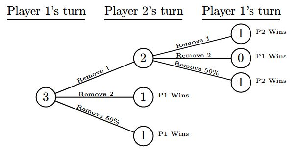
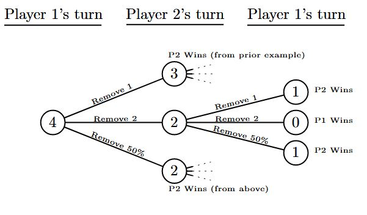
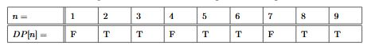

# select-problems
This repository and its files were authored by Christina Zhang in Fall-Winter 2020.

Table of Contents

- [About this repository](#about)
- [Priority Queue - Heap Implementation](#pq-hi)
- [Recursion and Dynamic Programming - Pebble Example](#pebble)
- [Competitive problems](#comp)
- [Acknowledgements and sources](#ack)
- [Contact](#contact)

- - - -
## About this repository <a name="about"/>
This repository consists of code for selected algorithms, data structures, or competitive problems/challenges.

- - - -
## [Priority Queue - Heap Implementation](priorityQueueHeap) <a name="pq-hi"/>
This program uses heaps to create a priority queue.  Also included is a driver file that demos the PQ implementation and a makefile to compile the files. 

- - - -
## [Recursion and Dynamic Programming - Pebble Example](RecursionAndDP.c) <a name="pebble"/>

Consider the following simple two player game:
- There is a pile of *n* pebbles.
- The  players  take  turns  removing  pebbles  from  the  pile.  Specifically  they **must** do one of the following on their turn:
  - Remove 1 pebble from the pile
  - Remove 2 pebbles from the pile
  - Remove half of the remaining pebbles from the pile (rounded up).
- The player that is forced to take the last pebble loses. 

We want to decide if there is a way for the first player to win the game (i.e., assuming perfect play by both players find out whether the first player to take their turn will always win). 

Start by showing that if *n* = 3 player 1 always wins (assuming optimal play):

Next show that if *n* = 4 player 1 always loses (assuming optimal play):

The recursive approach has a runtime of O(2^*n*).
So, while the previous approach solves the problem elegantly, it isn’t practical for even relatively small values of *n* (*n* = 65 took more than two minutes). The problem is that the naive solution solves the same sub-problems repeatedly (trivially we can see  there are only O(*n*) sub-problems prior to the current one). Fortunately, using dynamic programming we can avoid ever resolving any sub-problem. The idea is to keep the solutions to the sub-problems in a table and check if the solution is present prior to trying to compute the solution with recursion (this solves *n* = 65000 in 0.002 seconds).

Here is the DP table for *n* = 9:

- - - -
## Competitive problems <a name="comp"/>
| Problem | Solution |
| --- | --- |
| <a href='https://open.kattis.com/problems/vote'>Popular Vote</a> | [Python 3](vote.py) |
| <a href='https://open.kattis.com/problems/lostlineup'>Lost Lineup</a> | [C](lostlineup.c) |

- - - -
## Acknowledgements and sources <a name="ack">
- UTSA CS2123 Data Structures
- Kattis
- Leetcode

- - - -
## Contact <a name="contact"/>
christinazhang2013@gmail.com

